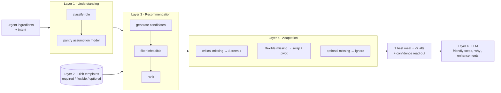

# AI decision logic — the 5-layer hybrid engine

The assistant does **not** "match recipes." A deterministic engine reasons about feasibility, confidence, effort, waste and novelty to pick ONE meal; an LLM is used only to write friendly, adapted instructions. This keeps recommendations trustworthy and reproducible.

## Layer 1 — Ingredient understanding (`lib/pantry-model.ts`)

- `classifyRole(name)` → `protein | starch | vegetable | dairy | other` via keyword sets.
- **Pantry assumption model** — three confidence bands, so we never block a recommendation on a staple the user obviously has:

| Band | Examples | Behaviour |
|---|---|---|
| **HIGH** | salt, cooking oil, water | Assumed silently. Never surfaced, never blocks. |
| **MEDIUM** | pepper, garlic, onion, butter, stock, flour, tomato paste | Assumed; shown under **Assumed pantry** so the user can mentally check. |
| **LOW** | herbs, spices, lemon, specialty sauces | Treated as **Optional** flavour. Never assumed present, never a warning. |

`buildEngineInventory(urgent)` assembles the engine's internal inventory contract from *urgent ingredients ∪ assumed staples* — the user is never asked to fill it in.

## Layer 2 — Dish knowledge base (`lib/dish-templates.ts`)

Structured **templates**, not finished recipes. Each `req` carries a criticality that drives the whole decision:

- **essential** → dish identity. Missing ⇒ infeasible, never shown. (`chicken` + `rice` for chicken & rice)
- **important** → supporting/flexible. Missing ⇒ a swap note; dish still works. (onion, stock)
- **optional** → flavour enhancer. Missing ⇒ ignored silently. (herbs, pepper)

These map 1:1 to the brief's **Core / Supporting / Optional** classification, and are merged ahead of the existing protein-forward library so use-up scenarios have coherent dishes to win with.

## Layer 3 — Recommendation engine (`lib/decision-engine.ts` → `findRecipes`)

1. **Generate** candidates from every template.
2. **Filter** out any dish missing an *essential* it can't cover from urgent ∪ assumed pantry (`viable = false`).
3. **Rank** the rest by a weighted score: ingredient usage / waste reduction + intent match (quick/comfort/healthy…) + flavour coherence + effort suitability − **novelty penalty**.
4. Return **one best + at most two alternatives**. Never a browsable list.

**Confidence read-out** attached per meal:

- **Completion** — feasibility + swap count (High if no swaps).
- **Effort** — hands-on difficulty over total time (a hands-off tray bake is Low even at 50 min).
- **Taste** — coverage-weighted score + swap count.

## Layer 4 — LLM generation

The LLM's job is narrow: write the "why", adapt and scale friendly step-by-step instructions, and suggest optional enhancements — **never invent an unavailable ingredient.** The existing `api/generate-recipe.ts` endpoint already enforces "use only listed ingredients; build one coherent dish; never force an ingredient," and the deterministic engine guarantees a complete, cookable fallback so the prototype is reliable with or without an API key.

## Layer 5 — Recipe adaptation

| Missing ingredient type | Behaviour | Example |
|---|---|---|
| **Critical** | Do NOT recommend the dish → Screen 4 | No pasta ⇒ never suggest a spaghetti dish |
| **Flexible** | Transform into a valid dish, don't fake a substitute | Missing cream ⇒ a *Silky Tomato Pasta*, not "creamy pasta minus the cream" |
| **Optional** | Ignore, no warning | Missing herbs ⇒ nothing said |

## Novelty

Recency penalties (`noveltyMultiplier`) demote recently-cooked and skipped dishes and gently re-surface loved ones. Novelty can reorder candidates but **never** resurrects an infeasible dish or overrides taste/effort — feasibility and confidence come first, always.
