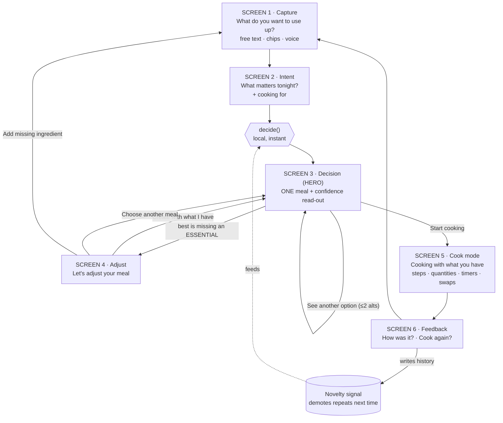

# User flow

## Notes

- **Capture → Intent → Decision** is the whole onboarding. No account, no pantry setup, no category tour.
- The **decision is computed locally and instantly** from `(urgent ingredients, intent, cook history)` — it's deterministic, so the flow always reflects the latest capture and demos reliably with no network dependency.
- **Screen 4 is conditional.** It only appears when the best feasible dish is still missing a truly *essential* ingredient (the engine's `sparse` flag). In the common case the user goes straight from Intent to a confident Decision.
- **The loop closes:** feedback writes to `history`, which the novelty layer reads on the next decision to avoid repeating recent meals — without ever overriding feasibility or taste.
